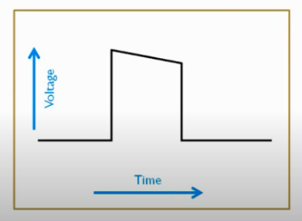
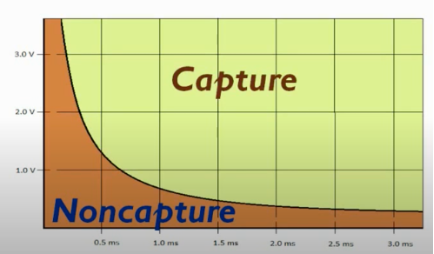
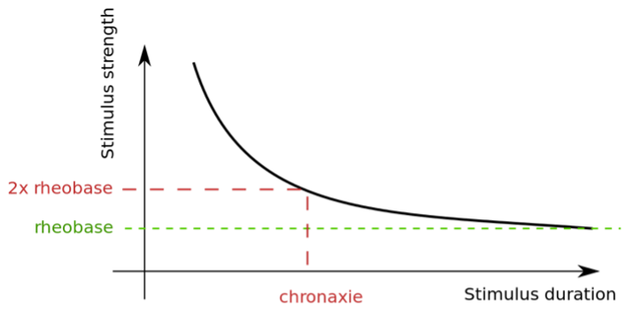

# bme_506_final_project
Pacemaker Energy Saving Algorithm
Author: Alex Thomason

# Definitions
* Cardiac pacemaker – A medical device that generates electrical impulses delivered by electrodes to cause the heart muscle chambers to contract and therefore pump blood; by doing so this device replaces and/or regulates the function of the electrical conduction system of the heart.
* Capture – Depolarization of the atria and/or ventricles by an electrical stimulus delivered by an artificial pacemaker
* Threshold – The minimum amount of electrical energy needed to consistently capture the heart outside of the heart’s refractory period
* Pulse Duration – Length of time [ms] that the pacing pulse occurs
* Pulse Strength - Amplitude of Volts [V] or Amps [mA] of a pacing pulse. In this paper, pulse strength will be referred to in Volts [V].
* Output – stated as ___V @ ___ms
* Safety Margin – Programming the pacemaker at a high enough output (amplitude and duration) above the threshold to make sure that we capture the heart consistently. Having a high enough safety margin is important to consistently capture the heart if the patient’s threshold fluctuates.
    * Industry standard = either 2x threshold voltage or 3x pulse width
* Rheobase - The lowest stimulus current that continues to capture the heart when the stimulus duration is made very long.
* Chronaxie - The pulse duration at twice the rheobase
* Pacing Energy – Energy consumption of a pacing pulse
* Most energy Efficient Pacing – Occurs at chronaxie
* Strength Duration Curve – Curve that relates pacing threshold to pulse duration. The plot of a strength duration curve is pulse amplitude (either voltage [V] or current) vs pulse duration [ms]. In this paper, the strength-duration curve will be Pulse Amplitude [V] vs Pulse Duration [ms].

            
*Figure 1: Shape of a stimulating pulse*    *Figure 2: Strength Duration Curve*                      *Figure 3. Rheobase and Chronaxie on Strength-Duration Curve*

# Introduction

When pacing the heart, the pacemaker must capture the heart 100% of the time. The pacemaker should be programmed to have a pacing output that is high enough to stimulate the myocardial tissue consistently but low enough to avoid unnecessarily draining battery life. Because a pacemaker battery has a limited charge, battery life management is a critical consideration in the design to maximize device longevity. Hardware developments (including high-energy-density battery, high impedance, and low threshold leads) and software improvements (for pacing with lowest feasible energy) have been developed to enhance the lifetime of the pacemaker. 

A pacemaker battery life is dependent on programmable parameters, principally pulse amplitude and pulse duration. High factory default settings cause an excessive current drain. The physician is responsible for setting the voltage and duration to the appropriate values directly after implantation. Additionally, patients need to have post-implantation pacing checks to ensure those values are reasonable and safe. The frequency of these checks ranges between 3 months to a year (depending on the device) [2]. Physicians must instill a safety margin of voltage or pulse duration when programming pacemakers to ensure consistent myocardial tissue capture. The current industry standard for safety margin is two times the voltage threshold or three times the pulse-width threshold. An important equation to consider is the energy equation: 

`E =(V^2*t)/R`

Because the voltage term is squared, if the voltage doubles, then energy quadruples. If time doubles, energy doubles. Minimum pulsing energy occurs at chronaxie. In a study of 229 pacemaker patients, most patients had a pulse duration set at 0.45 ms or 0.5 ms (common factory defaults) from implantation even though the pacing voltage was set to be double the threshold voltage [1]. The pulse durations were too long and wasteful of energy.

The pacing threshold exhibits significant inter-individual variations. After implantation, the pacemaker must be programmed with various parameters to fit each patient. Even in an individual, the pacing threshold may vary over time because of spontaneous threshold rise after implantation, micro-dislodgment of the pacemaker lead, diurnal changes, and changes secondary to drugs or myocardial ischemia [4]. These varying pacing thresholds may raise safety risks due to narrowing pacing stimulation safety margins. Conversely, unnecessarily high pacing output shortens battery life. The ability to automatically track threshold and to adjust the pacing outputs accordingly will maximize patient safety and minimize battery drain for pacing [4]. Additionally, optimizing threshold detection algorithms could help reduce battery size and the time it takes for pacemaker programming. Several manufacturers have developed algorithms for gathering threshold data, which is used either on a beat-by-beat basis to ensure a passed response or intermittently to adjust output parameters. A summary of existing capture management algorithms is summarized below [5]:

	* St. Jude/Pacemaker Autocapture
	    * Type: determines evoked response (capture) beat-by-beat
	    * Backup pulse: 4.5 V delivered immediately if no capture is detected
	    * Threshold search starts when: two consecutive backup pulses detected
	    * Increase voltage: 0.125 V steps until two consecutive captures are detected
	    * Safety margin: 0.3 V added
	* Boston Scientific Automatic Capture
	    * Type: Beat-to-beat verification of myocardial capture based on ventricular evoked response
	    * Backup pulse: Backup pulse of (measured threshold + 1.5 V) delivered 100 ms after initial stimulus if no capture is detected
	    * Threshold search starts when: No capture for 2/4 beats 
	    * Safety Margin: 0.5 V above measured threshold (ventricular voltage)
	* Medtronic Ventricular Capture Management
	    * Type: Intermittent – activated every 15 mins for 42 days
	    * Measure Rheobase: determined at 1 ms by amplitude decrement until loss of capture and then by amplitude increment until capture is confirmed.
	    * Measure Chronaxie: determined by doubling the programmed amplitude and decreasing the pulse width (and sequentially increasing the amplitude to capture)
	    * Recommended setting based off rheobase and chronaxie

These three methods find capture by increasing voltage, but every time the voltage is under the threshold, the pacemaker generates a backup pulse of higher voltage. It’s a waste of energy to continuously initiate those backup pulses, especially if the threshold detection is on a beat-by-beat basis. St. Jude and Boston Scientific algorithms do not find the optimal stimulus duration, only the threshold for the stimulus amplitude. Optimizing both stimulus duration and amplitude will save energy. My goal is to develop an algorithm that improves/combines these three approaches by efficiently finding the chronaxie (the point of minimum pulsing energy) and dynamically adjusting pulse amplitude and duration.

# Purpose of Energy Saving Algorithm

The idea of this project stems from the desire to save as much energy as possible in a pacemaker. Pacemakers usually assume that the stimulation amplitude and duration operate around chronaxie (the point of minimum energy usage). I want to write an algorithm to find the minimum energy needed to stimulate a patient’s myocardial tissue.  This algorithm would be used periodically by a pacemaker within the patient to automate finding the chronaxie point of stimulation and setting the pulse duration and amplitude of an appropriate safety margin. By using this algorithm, the pacemaker would have a way to find the value of minimum energy usage, thus extending battery life.

# Code Structure

This section covers the code structure of the git repository. Each module (file) has modular functions along with docstrings to describe inputs, outputs, and what it does. The following figure shows the flow of the repository code modules:
Figure 4. Flow Diagram - Repository Modules

## requirements.txt
Includes necessary packages for the code to run properly. To run the code, create a virtual environment with python by typing ‘python -m venv <VirtualEnvironmentName>’ where <VirtualEnvironmentName> is the desired name of the virtual environment. For example python -m venv MyVenv makes a virtual environment with the name MyVenv. For Linux (MacOS), activate the virtual environment by typing ‘source <VirtualEnvironmentName>/bin/activate’ in the same folder in which you created the virtual environment. After activating the virtual environment, type pip install -r requirements.txt to install the packages. Refer to [6] for more detailed instructions on virtual environments.

## generate_capture_data.py
Some “fake” data will be generated to simulate when the patient’s myocardial tissue would be captured. This data will have 3 columns:
1. Stimulation Duration (constant)
2. Stimulation Amplitude
3. Whether or not the tissue is “captured” or depolarized

This data is generated from experimental data points. The purpose of generating this data is to simulate capture threshold data of myocardial tissue for a patient. The capture threshold detection algorithm will use this data to try and find capture points that match the experimental data points.

## import_capture_data.py
Imports the data generated by generate_capture_data.py, parses each column into an array, and converts the values into floats. Each column in the data in the file will be converted into a list of float values that will be used in the capture threshold detection algorithm.
capture_threshold_detection.py
The algorithm iterates the stimulation amplitude [V] downward at a constant stimulation duration to find the “capture (threshold) points” on the strength-duration curve. It will iterate through voltage values until it finds the capture threshold (within 5% accuracy above the actual threshold value). Figure 7 goes into more detail about this process. After the algorithm finds the capture threshold value point, it will repeat that process for four different duration values. After the capture threshold value for each stimulus duration, the data points are stored in an array and used to optimize a strength-duration curve trendline. Rheobase and chronaxie are retrieved from that trendline equation. After the chronaxie value is found, the pacemaker stimulation duration and amplitude settings will be altered to save energy.

## strength_duration_curve.py
This file contains functions to perform calculations on the threshold data gathered from the
capture_threshold_detection.py. First, a trendline is found by optimizing the strength-duration curve
formula: 𝑉 = 𝑉 ∗ (1 + 𝑡 /𝑡), where 𝑉 = 𝑟h𝑒𝑜𝑏𝑎𝑠𝑒 and 𝑡 = 𝑐h𝑟𝑜𝑛𝑎𝑥𝑖𝑒. Rheobase and chronaxie are 𝑟𝑐𝑟𝑐
optimized to fit the capture threshold data. Plots of the experimental data, optimized curve, and energy are displayed for reference. Energy of the stimulation at chronaxie is also calculated for reference.
patient.log file
Displays logging information about the capture threshold process, and results for a given set of data for a patient. This information includes:
• When a stimulus voltage was captured
• When a stimulus voltage was not captured
• Capture threshold data for duration and voltage
